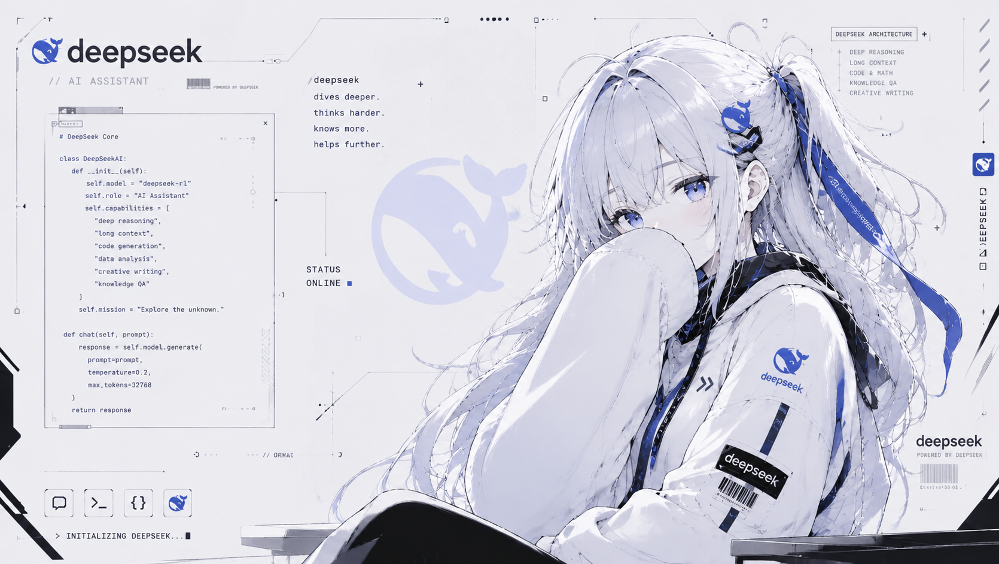
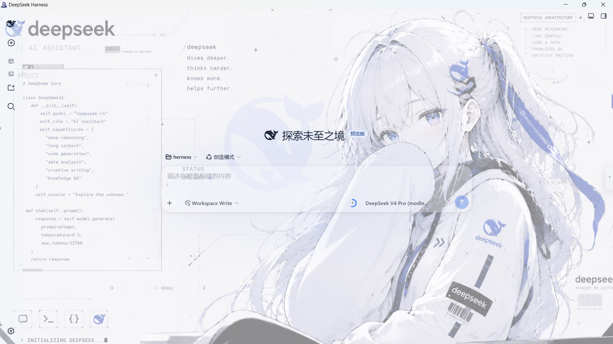

# DSH Custom Wallpaper

DeepSeek Harness Web GUI 的自定义壁纸引擎：上传图片（客户端 WebP/JPEG 压缩）、毛玻璃模糊、面板半透明，以及自动字体颜色联动。

## 壁纸预览





## 功能

- **预设壁纸**：官方壁纸 / 深蓝渐变 / 浅蓝渐变，一键切换。
- **上传自定义图片**：选择本地图片后，客户端自动压缩（WebP/JPEG）并计算亮度。
- **毛玻璃模糊**：可调 0–20px 背景模糊。
- **面板半透明**：可调 30%–100% 面板不透明度。
- **字体颜色联动**：自动跟随壁纸亮度（也可手动指定浅色/深色字体）。
- **跟随系统外观**：浅色 / 深色主题分别独立配置。
- **可选余额显示**：用户主动开启后，在侧边栏显示 DeepSeek API 账户余额。

## 安装

```sh
dsh plugin --profile web add "github:baihejiangnan/dsh-custom-wallpaper"
```

随后重启 `dsh web` 服务并硬刷新页面。

## 更新

```sh
dsh plugin --profile web remove @baihejiangnan/dsh-custom-wallpaper
dsh plugin --profile web add "github:baihejiangnan/dsh-custom-wallpaper"
```

## 卸载

```sh
dsh plugin --profile web remove @baihejiangnan/dsh-custom-wallpaper
```

## 使用

设置段位于 **设置 > 自定义壁纸**。

## 隐私与权限

- 上传的图片只在浏览器本地压缩并保存，不会上传到本仓库或第三方服务。
- 余额显示默认关闭。只有用户在设置中主动开启后，宿主端才会读取 DSH 已配置的 `DEEPSEEK_API_KEY`，并直接请求 DeepSeek 官方余额接口。
- API Key 不会返回浏览器；浏览器仅接收余额查询结果。余额接口响应禁止缓存。
- 插件不会读取工作区文件，也不会执行 shell、Git 或 GitHub 命令。

## License

源代码采用 BSD-3-Clause License。本项目是非官方社区插件，与 DeepSeek 官方没有隶属或背书关系；README 截图、预设壁纸及其中出现的名称、角色形象和商标不因源代码许可证而改变其各自的权利归属。
